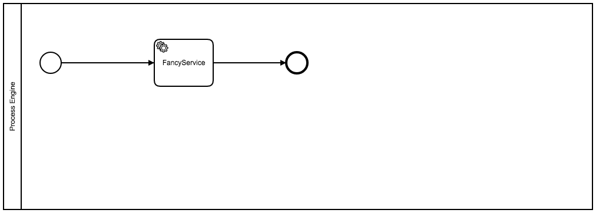

# Example of mocking plain java delegates with camunda

This project is based on the generation by the Maven archetype
[camunda-archetype-servlet-war-7.5.0](http://docs.camunda.org/latest/guides/user-guide/#process-applications-maven-project-templates-archetypes).

## Show me the important parts!
This example shows how to implement tests with plain java delegates like you would do with expression based delegates like CDI-Beans.

## How does it work?

For further description please have a look at our blogposts:

English: https://blog.akquinet.de/2016/11/04/camunda-bpm-test-your-processes-based-on-plain-old-java-delegates/

German: https://blog-de.akquinet.de/2016/11/08/camunda-bpm-testen-von-prozessen-mit-java-delegates/

                                 
## How to use it?
Just as you would test processes with CDI based Java Delegates you can do that now with plain old java delegates as well.
Please check `MockingTest` for usage.

## Environment Restrictions
Built and tested against Camunda BPM version 7.5.0.

## Known Limitations

## Improvements Backlog

## License
[Apache License, Version 2.0](http://www.apache.org/licenses/LICENSE-2.0).

<!-- HTML snippet for index page
  <tr>
    <td></td>
    <td><a href="snippets/mocking-java-delegates">Camunda BPM Process Application</a></td>
    <td>A Process Application for [Camunda BPM](http://docs.camunda.org).</td>
  </tr>
-->
